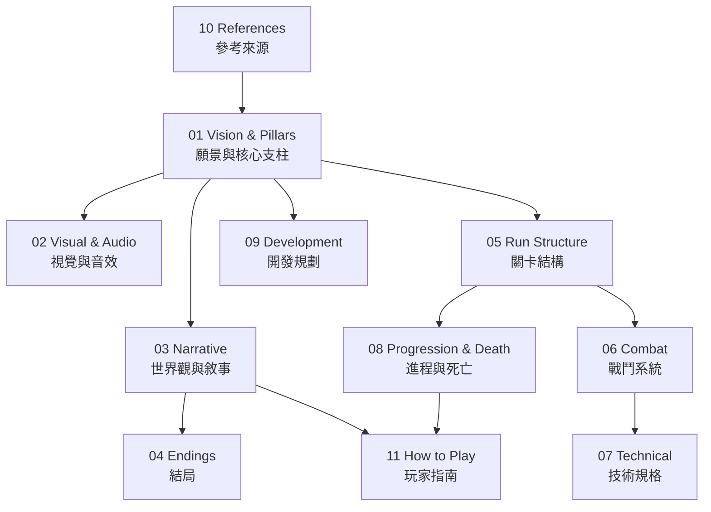

# CENDRES — Game Design Document
**Version 0.4 | LLM 文本生成系統**

| 欄位 | 內容 |
|---|---|
| 工作標題 | Cendres |
| 類型 | 第一人稱塔防 / Roguelite |
| 目標平台 | PC（MacOS / Linux） |
| 技術棧 | Odin + Raylib |
| 場景結構 | 箱庭（封閉場景，無大世界） |
| 視角技術 | Raycasting 2.5D |
| 開發者 | Brian |
| GDD 版本 | 0.5 — 神話框架、Lumen 宇宙觀、Fragment 系統加入 |

---

## 索引地圖

---

## 文件索引

| 檔案 | 內容 |
|---|---|
| [01-vision-pillars.md](01-vision-pillars.md) | Vision Statement、核心 Fantasy、核心支柱 |
| [02-visual-audio.md](02-visual-audio.md) | 視覺語言、音效方向 |
| [03-narrative.md](03-narrative.md) | 世界觀、完整真相、Beacon 角色、玩家起源（§5.5） |
| [04-endings.md](04-endings.md) | 四個結局、結局設計哲學（§6.4 薛西弗斯對照） |
| [05-run-structure.md](05-run-structure.md) | Run 節拍圖、波次升級、輪間持續性 |
| [06-combat.md](06-combat.md) | 戰鬥哲學、Lantern 能力、結構行為、捕捉流程 |
| [07-technical.md](07-technical.md) | 技術選型、資料結構、Raycasting、LLM 系統 |
| [08-progression-death.md](08-progression-death.md) | 玩家進程 Meta-Arc、死亡與敘事整合 |
| [09-development.md](09-development.md) | 開發階段規劃、待解問題 |
| [10-references.md](10-references.md) | 參考作品與靈感來源 |
| [11-how-to-play.md](11-how-to-play.md) | 揭露哲學備忘、玩家指南（Lumen、Run 節奏、系統取捨、死亡持續性） |
