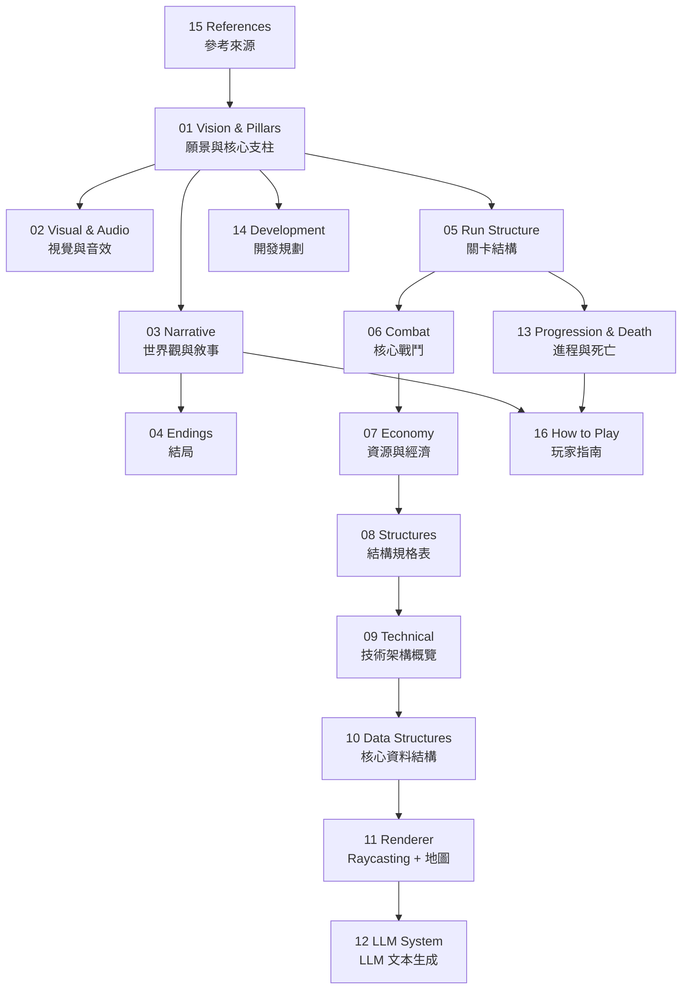

# CENDRES — Game Design Document
**Version 0.6 | 缺失子系統定義：氣質系統（§8.1a）、捕捉主動光反制、結構暗期規則、活體轉化遞減**

| 欄位 | 內容 |
|---|---|
| 工作標題 | Cendres |
| 類型 | 第一人稱塔防 / Roguelite |
| 目標平台 | PC（MacOS / Linux） |
| 技術棧 | Odin + Raylib |
| 場景結構 | 箱庭（封閉場景，無大世界） |
| 視角技術 | Raycasting 2.5D |
| 開發者 | Brian |
| GDD 版本 | 0.6 — 氣質系統（§8.1a）、捕捉主動光、結構暗期、活體轉化遞減 |

---

## 索引地圖

---

## 文件索引

| 檔案 | 內容 |
|---|---|
| [01-vision-pillars.md](01-vision-pillars.md) | Vision Statement、核心 Fantasy、核心支柱 |
| [02-visual-audio.md](02-visual-audio.md) | 視覺語言、音效方向 |
| [03-narrative.md](03-narrative.md) | 世界觀、完整真相、Beacon 角色、玩家起源（§5.5） |
| [04-endings.md](04-endings.md) | 四個結局、結局設計哲學（§6.4 薛西弗斯對照） |
| [05-run-structure.md](05-run-structure.md) | Run 節拍圖、波次升級、輪間持續性 |
| [06-combat.md](06-combat.md) | 戰鬥哲學、Lantern 能力、結構行為、捕捉流程（§8.1–8.6） |
| [07-economy.md](07-economy.md) | Dye 生產鏈、活體轉化、Fog Erosion（§8.7–8.9） |
| [08-structures.md](08-structures.md) | 結構規格表：Charge Turret、Vigilance Lens、Echo Marker、Tether Line、Silent Repair Unit、Shield Emitter（§8.10–8.15） |
| [09-technical.md](09-technical.md) | 技術選型、模組切分、Game State Machine（§9.1, §9.3–9.4） |
| [10-data-structures.md](10-data-structures.md) | 所有核心 Odin 型別定義：Light_Source、Void_Entity、Light_Structure、Player（§9.2） |
| [11-renderer.md](11-renderer.md) | Raycasting 光暗系統、場景地圖結構（§9.3–9.4） |
| [12-llm.md](12-llm.md) | LLM 文本生成系統：設計哲學、Context 結構、System Prompt、fallback（§9.5） |
| [13-progression-death.md](13-progression-death.md) | 玩家進程 Meta-Arc、死亡與敘事整合 |
| [14-development.md](14-development.md) | 開發階段規劃、待解問題 |
| [15-references.md](15-references.md) | 參考作品與靈感來源 |
| [16-how-to-play.md](16-how-to-play.md) | 揭露哲學備忘、玩家指南（Lumen、Run 節奏、系統取捨、死亡持續性） |
