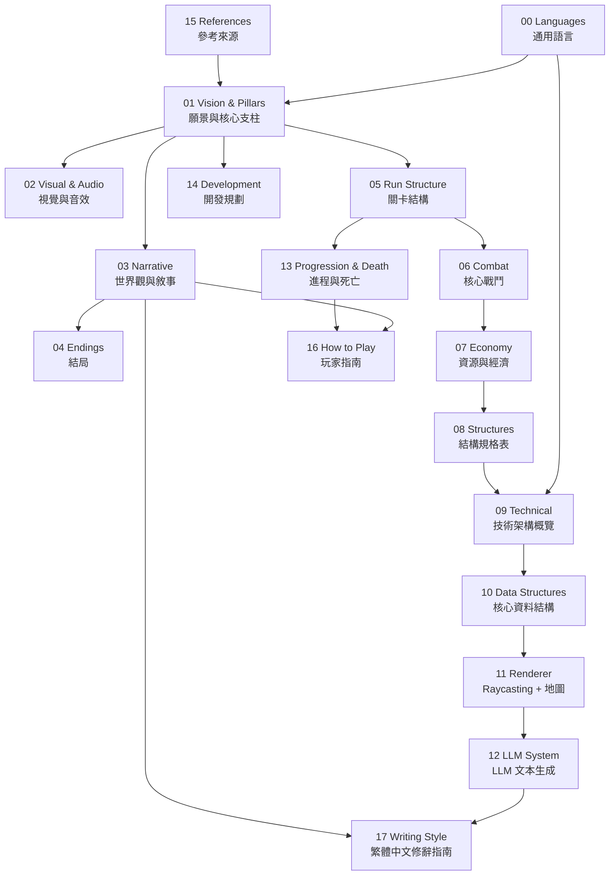

# CENDRES — Game Design Document
**Version 0.6 | 待補子系統定義：氣質系統（§8.1a）、捕捉主動光反制、結構暗期規則、活體轉化遞減**

| 欄位 | 內容 |
|---|---|
| 工作標題 | Cendres |
| 類型 | 第一人稱塔防 / Roguelite |
| 目標平台 | PC（MacOS / Linux / Windows） |
| 技術棧 | Odin + Raylib |
| 場景結構 | 箱庭（封閉場景，無大世界） |
| 視角技術 | Raylib 3D + GLSL fragment shader |
| 開發者 | Brian |
| GDD 版本 | 0.6 — 氣質系統（§8.1a）、捕捉主動光、結構暗期、活體轉化遞減 |

---

## 索引地圖

---

## 文件索引

### 0. 通用語言（Ubiquitous Language）

| 檔案 | 內容 |
|---|---|
| [language/00-languages.md](language/00-languages.md) | DDD 通用語言：有界上下文、全域詞彙表、禁止模糊用法、命名規則（GDD ↔ Odin 對照） |

### A. 核心設計（Design & Vision）

| 檔案 | 內容 |
|---|---|
| [design/01-vision-pillars.md](design/01-vision-pillars.md) | 願景宣言、核心 Fantasy、五大核心支柱 |
| [design/02-visual-audio.md](design/02-visual-audio.md) | 視覺語言、色調系統、音效方向 |
| [design/03-narrative.md](design/03-narrative.md) | 世界觀、完整真相、**餘燼**角色、玩家起源（§5.5） |

### B. 遊戲系統（Gameplay Systems）

| 檔案 | 內容 |
|---|---|
| [systems/04-endings.md](systems/04-endings.md) | 四個結局、結局設計哲學（§6.4 薛西弗斯對照） |
| [systems/05-run-structure.md](systems/05-run-structure.md) | Run 節拍圖、波次升級、跨輪持續性 |
| [systems/06-combat.md](systems/06-combat.md) | 戰鬥哲學、Lantern 能力、結構行為、捕捉流程（§8.1–8.6） |
| [systems/07-economy.md](systems/07-economy.md) | Dye 生產鏈、活體轉化、霧蝕系統（§8.7–8.9） |
| [systems/08-structures.md](systems/08-structures.md) | 結構規格表：Charge Turret、Vigilance Lens、Echo Marker、Tether Line、Silent Repair Unit、Shield Emitter（§8.10–8.15） |
| [systems/13-progression-death.md](systems/13-progression-death.md) | 玩家進程 Meta-Arc、死亡與敘事整合 |

### C. 技術實作（Technical Implementation）

| 檔案 | 內容 |
|---|---|
| [technical/09-technical.md](technical/09-technical.md) | 技術選型、模組切分、Game State Machine（§9.1, §9.3–9.4） |
| [technical/10-data-structures.md](technical/10-data-structures.md) | 所有核心 Odin 型別定義：Light_Source、Void_Entity、Light_Structure、Player（§9.2） |
| [technical/11-renderer.md](technical/11-renderer.md) | 3D + GLSL 光暗系統、場景地圖結構與幾何映射（§9.3–9.4） |
| [technical/12-llm.md](technical/12-llm.md) | LLM 文本生成系統：設計哲學、Context 結構、System Prompt、fallback（§9.5） |

### C2. 文本風格（Writing Style）

| 檔案 | 內容 |
|---|---|
| [writing/17-writing-style.md](writing/17-writing-style.md) | 繁體中文修辭指南：白話文運動過渡期語感、用字句法節奏規則、**餘燼**on / Codex / Imprint 分體裁調整、LLM System Prompt 擴充 |

### D. 玩家體驗（Player Experience）

| 檔案 | 內容 |
|---|---|
| [player/16-how-to-play.md](player/16-how-to-play.md) | 揭露哲學備忘、玩家指南（Lumen 運作、Run 節奏、系統取捨、死亡後留下什麼） |

### E. 開發管理（Project）

| 檔案 | 內容 |
|---|---|
| [meta/14-development.md](meta/14-development.md) | 開發階段規劃、待解問題 |
| [meta/15-references.md](meta/15-references.md) | 參考作品與靈感來源 |
